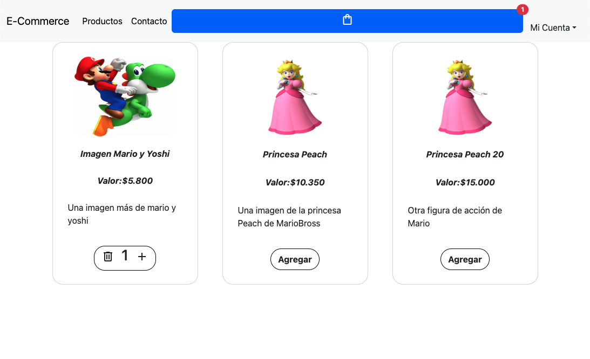

# Proyecto E-Commerce con React y Context API en Node y Expres

# Presentación del proyecto

Este proyecto de E-Commerce utiliza **ReactJS** y **Context API**, es complemtamente funcional y permite agregar y eliminar productos, además de agregarlos al carrito para simular un flujo de compra de un cliente visitando nuestra página. Permite acceder a la cuenta del usuario y acceder al menú de mantención de productos, para agregar, eliminar o actualizar la cantidad disponible o stock de un ítem.

También se agregó una página de contacto, la cuál carga un formulario para más información en caso de ser necesario.

## Inicio de Sesión. LogIn o Registro

Los usuarios registrados pueden iniciar sesión en sus cuentas utilizando esta ruta. Deben ingresar sus credenciales para acceder a funcionalidades adicionales.

Este es el menú que podrá visualizar un cliente logeado.

Si un usuario no está registrado, puede hacerlo seleccionando la vista "Registro de usuario", presionando el botón "No tengo cuenta aún, quiero registrarme".

## Página Principal

La ruta de inicio es la página de inicio del E-Commerce. Aquí, los usuarios pueden explorar una variedad de productos disponibles para la compra.

## Detalle de Producto Individual

Cada producto en el E-Commerce tiene su propia página o ruta que mostrará el detalle del producto. Aquí, los usuarios pueden ver detalles específicos de un producto y agregarlos al carrito de compras.

Los productos se pueden agregar al carro desde la vista general o desde la vista detalle.

Esta es la vista de los productos que han sigo agregados al carro de compras. Acá también es posible aumentar o reducir la cantidad de un determinado ítem, si la cantidad es menor que 1, el ítem se borrará completamente del carrito.

## Mantenedor de productos.

A modo de ejemplo, cada vez que un usuario hace LogIn la aplicación lo envía a la página Dashboard, dónde podrá visualizar una lista de los productos publicados, con la funcionalidad adicional de Agregar, Cambiar la Cantidad o Eliminar dicho producto.

Esta captura de pantalla muestra los campos necesarios para crear un nuevo producto.

Acá se muestra la opción de actualizar cantidad y eliminar un producto.

## Formulario de Contacto

Hemos habilitado la función de formulario contacto en caso que sea necesario algo que no esté desplegado en la página.

---

¡Espero que disfrutes explorando este ejemplo de E-Commerce!